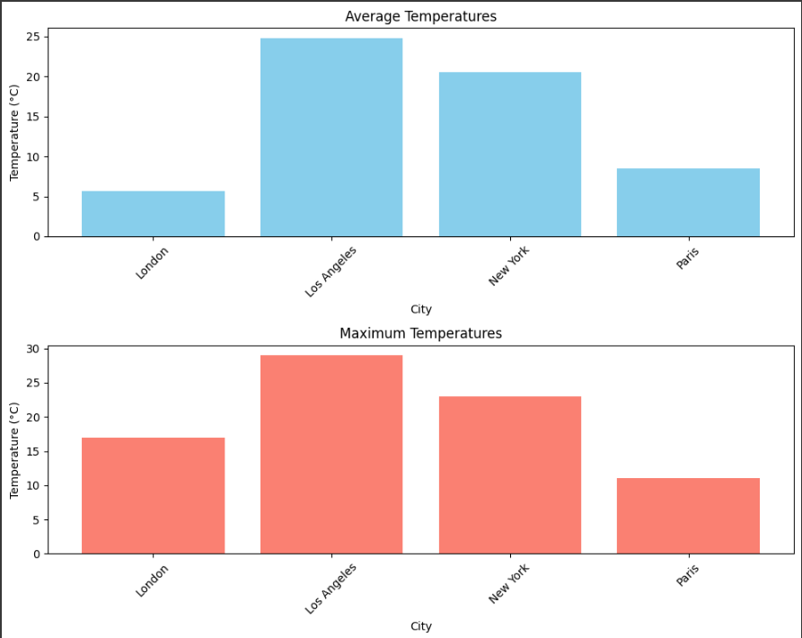
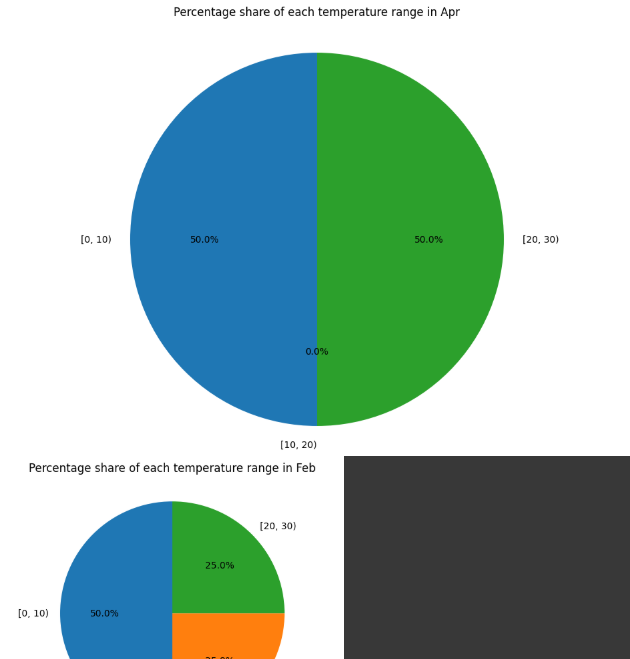
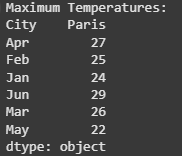
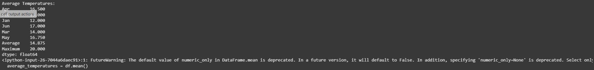
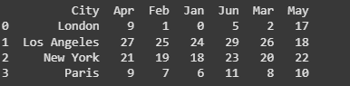
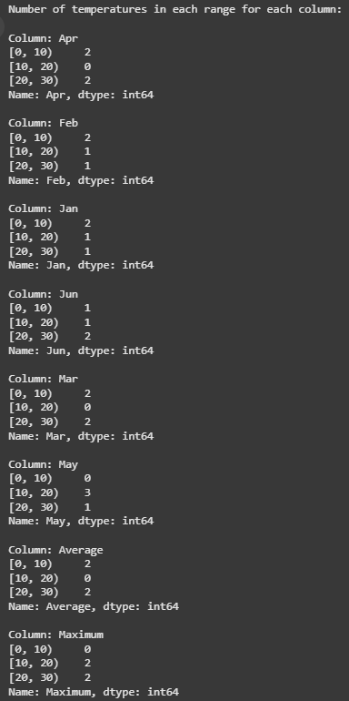

# 🐍 Python Weather & Transaction Analysis (Colab-Based)

A complete Python data analysis project built for Google Colab.  
It includes simulation of hotel billing with dynamic values, and visual analytics on real-world temperature data from Excel.

---

## 📦 Project Overview

### 🔹 Part 1: Hotel Transaction Simulation
Using random data to simulate hotel billing scenarios:
- Number of people
- Days of stay
- Extra charges
- VAT calculation
- Statistical insights like most expensive stays or shortest durations

### 🔹 Part 2: Temperature Analytics
Analyzing temperatures across cities from Excel:
- Average & max temperatures per city
- Total number of temperature records
- Pie chart distribution of values across ranges
- City comparisons with bar charts

---

## 📂 Files

- `Python_Final_Colab_With_Outputs.ipynb`: 📓 Full notebook with outputs
- `Temp.xlsx`: 🔢 Excel data for weather analysis
- `screenshots/`: 📸 Images of charts and printed output
- `README.md`: This file

---

## 📸 Example Output with Descriptions

### 1. 📊 Average & Max Temperatures Bar Chart
Displays the comparison between average and max temperatures for cities.

---

### 2. 📋 Table of Raw Temperature Data
Displays the full temperature dataset from Excel (cities and months).

---

### 3. 🔢 Count of Total Temperatures
Printed output showing number of values in the table.

---

### 4. 🧮 Count by Temperature Ranges
Displays how many values fall in each temperature range per column.

---

### 5. 🥧 Pie Charts of Distribution
Shows the percentage of values in temperature ranges for specific months.

---

### 6. 🧾 Max & Avg Printed Summary Tables
Console output of calculated statistics for each city and month.

---

## 💻 How to Run

Run this notebook easily in [Google Colab](https://colab.research.google.com) by uploading:
- `Python_Final_Colab_With_Outputs.ipynb`
- `Temp.xlsx`

---

## 🙋 Author

**Ebrahem Abonaser**  
📍 Tel Aviv District, Israel  
🔗 [LinkedIn Profile](https://www.linkedin.com/in/ebrahemabonaser)  
📧 ibrahem.abunasser.dev@gmail.com
